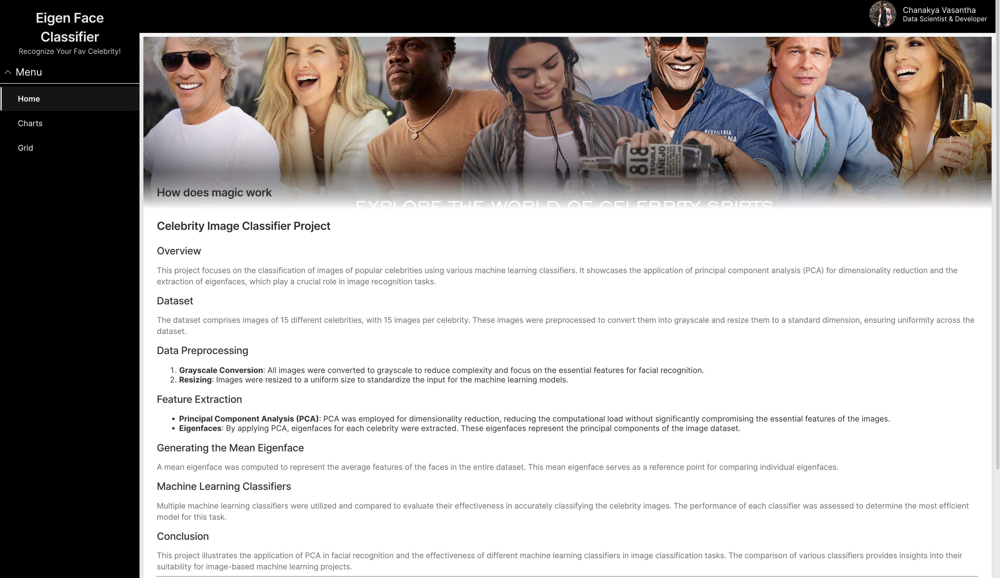

# Celebrity Image Classifier Project

## Overview
This project focuses on the classification of images of popular celebrities using various machine learning classifiers. It showcases the application of principal component analysis (PCA) for dimensionality reduction and the extraction of eigenfaces, which play a crucial role in image recognition tasks.

## Dataset
The dataset comprises images of 15 different celebrities, with 15 images per celebrity. These images were preprocessed to convert them into grayscale and resize them to a standard dimension, ensuring uniformity across the dataset.

## Data Preprocessing
1. **Grayscale Conversion**: All images were converted to grayscale to reduce complexity and focus on the essential features for facial recognition.
2. **Resizing**: Images were resized to a uniform size to standardize the input for the machine learning models.

## Feature Extraction
- **Principal Component Analysis (PCA)**: PCA was employed for dimensionality reduction, reducing the computational load without significantly compromising the essential features of the images.
- **Eigenfaces**: By applying PCA, eigenfaces for each celebrity were extracted. These eigenfaces represent the principal components of the image dataset.

## Generating the Mean Eigenface
A mean eigenface was computed to represent the average features of the faces in the entire dataset. This mean eigenface serves as a reference point for comparing individual eigenfaces.

## Machine Learning Classifiers
Multiple machine learning classifiers were utilized and compared to evaluate their effectiveness in accurately classifying the celebrity images. The performance of each classifier was assessed to determine the most efficient model for this task.

## Conclusion
This project illustrates the application of PCA in facial recognition and the effectiveness of different machine learning classifiers in image classification tasks. The comparison of various classifiers provides insights into their suitability for image-based machine learning projects.

---

### Additional Sections
Depending on the scope of your project and the details you want to include, you might also consider adding the following sections to your README:

- **Installation and Setup**: Instructions for setting up the project environment.
- **Usage**: How to run the project or use the code.
- **Results and Discussion**: A summary of the classification results and any interesting findings or challenges encountered.
- **Contributing**: Guidelines for contributing to the project (if it's open for collaboration).
- **License**: The license under which your project is released.

